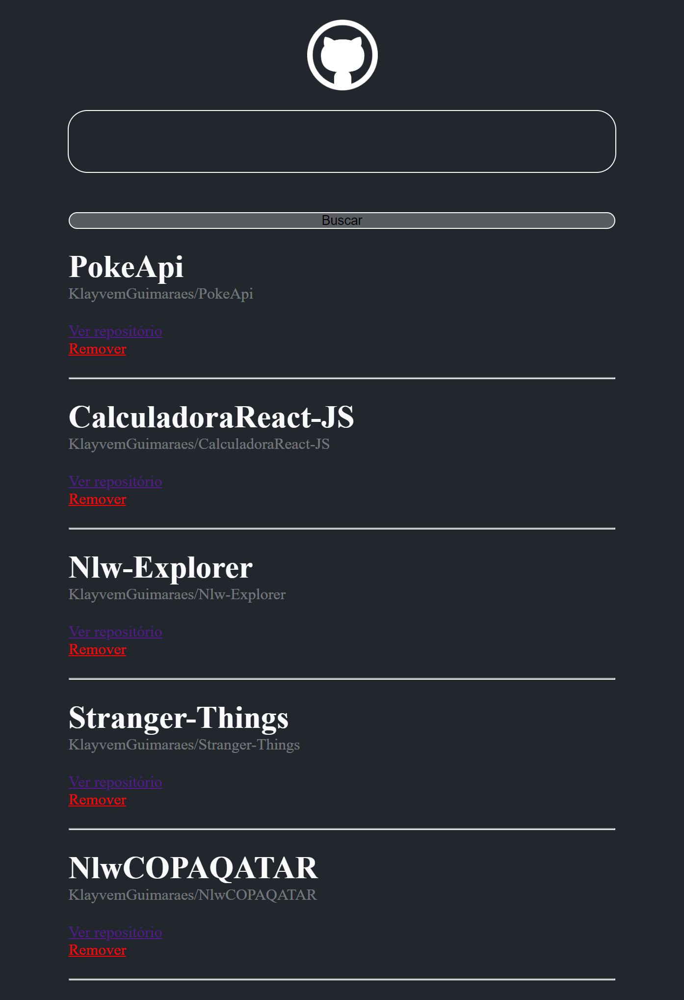

## Pesquisador de repositorios Github

    > Projeto desenvolvido puramente com React-js, durante o Bootcamp-Orange-Tech
    disponibilizado pela DIO em parceria com o banco Inter.
    > Desafio de projeto DIO 

## 🌍 Tecnologias

- REACT-JS
- JAVASCRIPT
- AXIOS ( API )
- STYLED-COMPONENTS

## 📚 Contato

Gmail : klayvemguik@gmail.com  
LinkedIn : https://www.linkedin.com/in/klayvem-guimar%C3%A3es-5a6700248/
